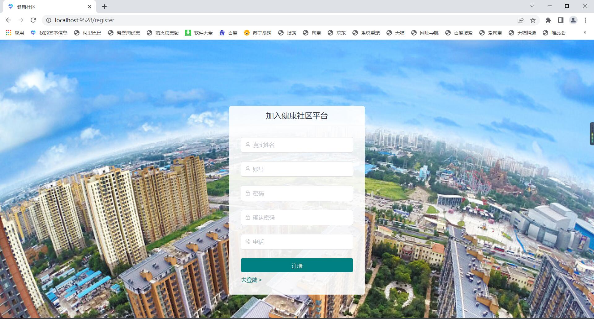
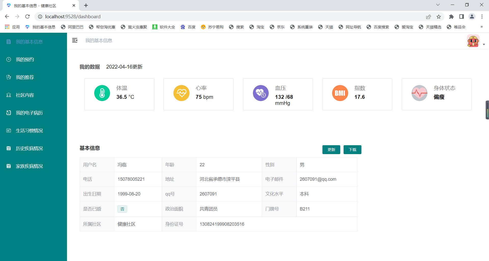
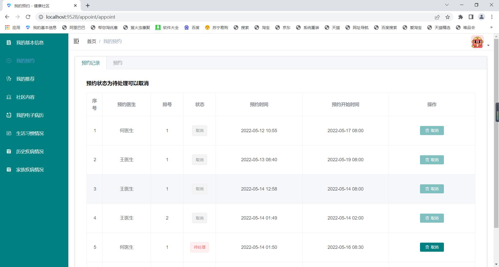
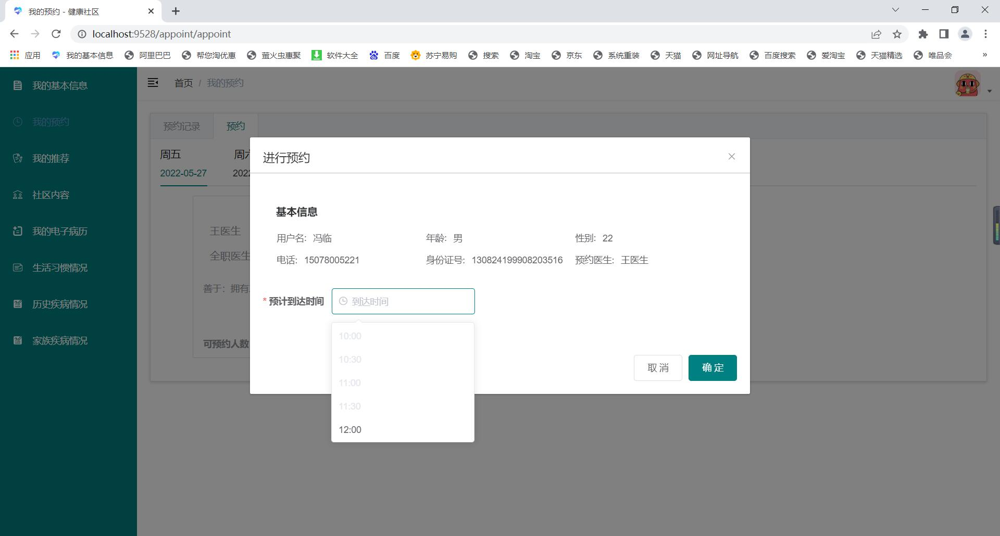
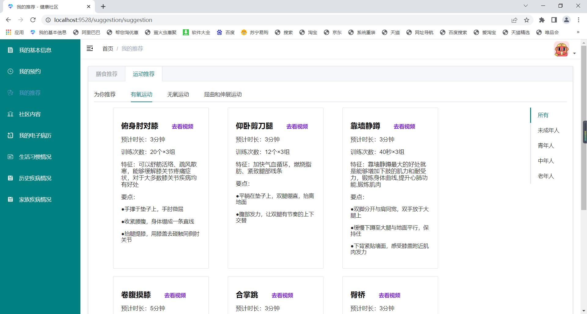
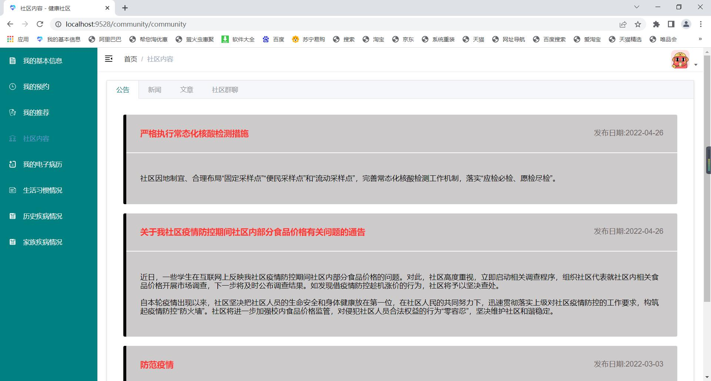
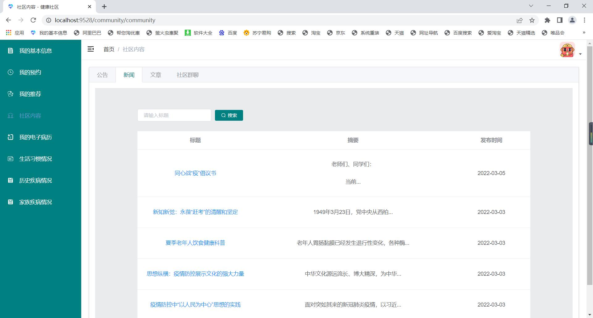
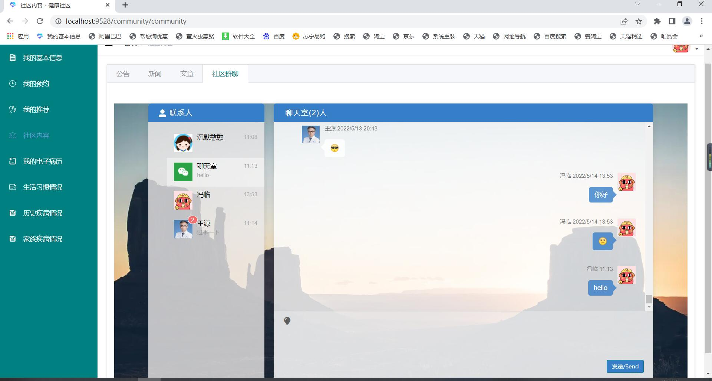

## 社区健康服务管理客户端

### 1.介绍

​    客户端的主要功能有，在线预约，在线聊天，查看文章，发布文章，查看基本信息，更新个人信息，上传图片更换头像，还有一些基本信息的录入。
   社区健康服务管理系统，由本人独立完成，前端采用的是Vue2.6版本，后端采用egg开发，数据库采用mysql,三种权限角色，其中包括，在线预约社区全职医生，疾病管理，居民的膳食健康，运动的健康，健康知识的普及，也包含着档案信息的管理，系统的管理，药品的管理等功能模块。具体的功能模块分别为：
      1）系统管理：包括用户的管理，角色的管理，日志的管理。根据用户划分权限分为管理员，社区医生和普通用户分为这三种用户。这三种角色所能够使用的系统资源会根据身份的不同而发生变化。管理员用户可以创建普通用户账号、编辑普通的信息及账号登录状态。用户具备个人信息修改、密码修改及退出登录功能。普通用户可自己注册账号。管理员的账号由后台创建，社区医生的账号则只能由管理员创建，同时也只有管理员才能进行角色的管理。管理员进行查看用户的日志消息的操作。记录用户操作信息。
      2）推荐管理：主要是膳食的推荐，跟运动的推荐。膳食推荐社区医生对食物进行分类，列出所有的食物基本信息，运动推荐也是社区医生进行分类，列出运动的基本信息，然后社区医生推荐那些人群做什么运动，社区医生对其进行分类，根据电子病例的医生给出的建议进行推送。社区居民进行浏览，查看。
      3）档案管理：管理员对居民基本信息进行管理，可以模糊按条件查找居民的基本信息，增加修改录入，批量导入居民信息，批量导入的时候默认生成账号密码。实现基本居民信息的基本电子信息化。
      4）数据管理：包括社区居民健康生理数据的管理,生活习惯数据的管理。生理数据主要是社区医生采集社区居民的身高，体重，根据身高体重计算BMI，根据收缩压，舒张压，判断居民的血压，还包括脉搏，血氧得出居民得身体状态，同时还应记录他们的血型。生活习惯数据管理包括记录居民的体育锻炼，锻炼的时长，饮食爱好，睡眠时长，饮酒情况，吸烟情况。社区居民进行查看。
      5）疾病管理：包括，现患病着，既往病史，家族病史的管理。现患病着记录社区患病人，方便社区医生，进行追踪治疗关心社区患病着；既往病史，记录社区居民的既往病史，如疾病名称，是否治愈，过敏物质，是否残疾等。家族病史，记录每个居民家里是否有一些特殊的遗传病史。
      6）预约管理：社区居民在线预约无需排队，也方便社区医生知道当天就医情况。包括社区居民预约的基本信息跟所预约的全职医生，预约时间，跟预约人数，排号。管理员进行管理，可以进行修改状态。
      7）电子病历：记录社区居民的看病信息。社区医生对社区居民的基本信息查看，询问病者身体状态，开出新的电子病历给社区居民。只有医生才拥有看病的权力，开出相应的药单，记录用药情况。
      8）文章咨询：包括社区的新闻，公告，以及普及一些健康知识的文章给居民查阅。包括增删改查。社区居民也可以分享文章。
      9）数据分析：社区管理员跟医生可以通过用饼状图、数据统计社区居民人数，患病数，等进行可视化的数据展示柱状图得查看。
      10）药品管理：社区管理员对药品的基本信息，跟库存进行维护管理，方便社区医生开药的时候，方便选择药品。
      11）社区内容：包括公告，新闻，文章，社区群聊的查看与交流，主要面向社区医生及社区居民进行查看，交流。

### 2.涉及技术（客户端前端）

Vue全家桶+Webpack+js+axios+wesocket+ElementUI
   1.对axios进行再一次封装
   2.对webpack进行proxy设置，避免跨域
   3.正侧表达的使用，自动读取身份证信息，校验手机号，邮箱。
   4.通过ESLint和Prettier规范代码，每一次commit都自动化格式代码。
   5.通过commitlint规范提交规范
   6.采用html2canvas做下载图片卡片
   7.moment 做日期的格式的处理
   8.loash 做深拷贝的使用
   9.qs 做表单的数据格式的转换
   10.wesocket通信做在线聊天


### 3. 部分功能截图

 #### （1）登录注册





#### （2）我的基本信息


#### （3）我的预约





#### （4）我的推荐




#### （5）社区内容








#### （6）个人中心


#### 说明：

​     功能的业务逻辑，跟主要实现方式，自己看代码就能看懂了。至于流程设计我就不介绍了，毕竟每个人的业务逻辑肯定不一样的。实在想要里面的流程设计，可以联系我哦。

### 4.规范

```bash

## Git 约定式提交格式校验

- feat:: 类型为 feat 的提交表示在代码库中新增了一个功能（这和语义化版本中的 MINOR 相对应）。
- fix:: 类型为 fix 的 提交表示在代码库中修复了一个 bug （这和语义化版本中的 PATCH 相对应）。
- docs:: 只是更改文档。
- style:: 不影响代码含义的变化（空白、格式化、缺少分号等）。
- refactor:: 代码重构，既不修复错误也不添加功能。
- perf:: 改进性能的代码更改。
- test:: 添加确实测试或更正现有的测试。
- build:: 影响构建系统或外部依赖关系的更改（示例范围：gulp、broccoli、NPM）。
- ci:: 更改持续集成文件和脚本（示例范围：Travis、Circle、BrowserStack、SauceLabs）。
- chore:: 其他不修改 src 或 test 文件。
- revert:: commit 回退。

## Git 分支命名规范
> ***git 分支分为集成分支、功能分支和修复分支，分别命名为 develop、feature 和 hotfix，均为单数。***
1. master（主分支，永远是可用的稳定版本，不能直接在该分支上开发）
2. develop（开发主分支，所有新功能以这个分支来创建自己的开发分支，该分支只做只合并操作，不能直接在该分支上开发）
3. feature-xxx（功能开发分支，在develop上创建分支，以自己开发功能模块命名，功能测试正常后合并到develop分支）
4. feature-xxx-fix(功能bug修复分支，feature分支合并之后发现bug，在develop上创建分支修复，之后合并回develop分支。PS:feature分支在申请合并之后，未合并之前还是可以提交代码的，所以feature在合并之前还可以在原分支上继续修复bug)
5. hotfix-xxx（紧急bug修改分支，在master分支上创建，修复完成后合并到 master）

```

### 5.客户端项目运行

```bash

### Tips:
- 使用 yarn 包管理工具
yarn install           -------安装所有依赖
yarn dev               -------运行项目
yarn build:prod        -------打包项目
 "node": ">=8.9",
```


This will automatically open http://localhost:9528

